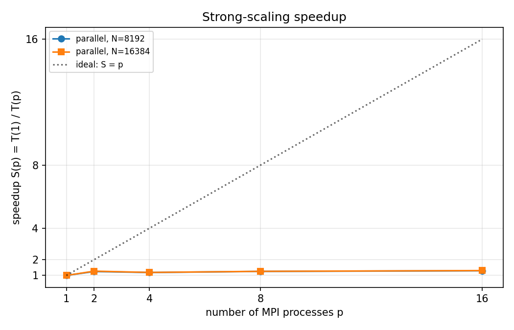
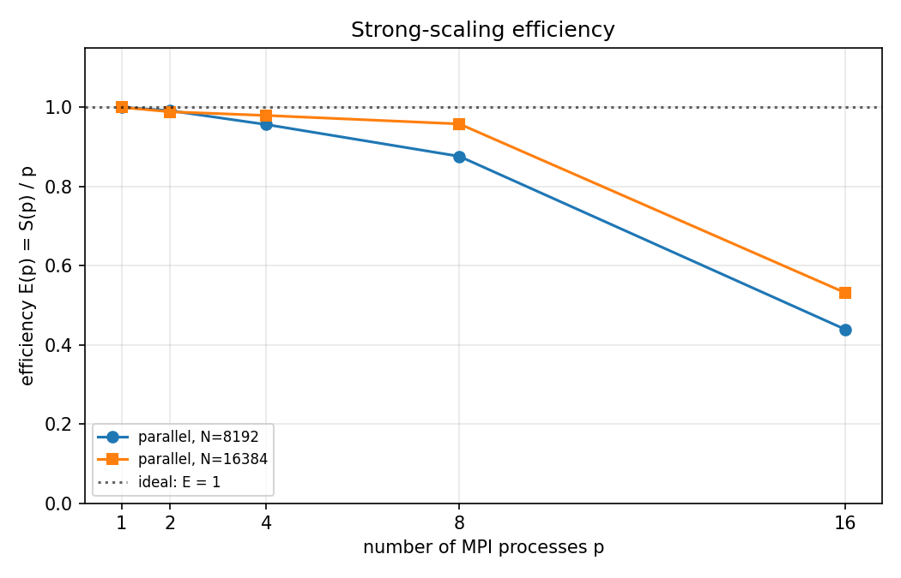

# 并行计算 II 第二次作业报告

**题目**：基于 MPI 的矩阵–向量乘法并行实现
**作者**：（请在此处填写学号 + 姓名）
**日期**：2026 年 5 月 29 日

---

## 1. 任务回顾

给定 $N \times N$ 矩阵 $A$ 与长度为 $N$ 的向量 $x$，本作业要求用 MPI 实现并行的稠密矩阵–向量乘法 $y = A x$，其中

$$
A_{ij} = (i \cdot 7 + j \cdot 13) \bmod 1000, \qquad
x_j    = (j \cdot 3 + 1) \bmod 100.
$$

需要完成三个算例：

| 算例 | $N$  | 主要考察点                  | 是否整除 16 |
| :--: | :--: | :-------------------------: | :---------: |
|  S   |  32  | 正确性 / 截图               |     是      |
|  M   | 1000 | 不整除时必须用 `MPI_Gatherv`|   **否**    |
|  L   | 8192 | 性能与加速比                |     是      |

并完成拓展题：在 $p \in \{1,2,4,8,16\}$ 下绘制强缩放加速比与并行效率曲线。

---

## 2. 划分方法与通信选择

### 2.1 数据划分：1D 行块

由于不同 $y_i$ 之间相互独立，矩阵的“行”是天然的并行任务粒度，因此选择**1D 行块划分**：

- 进程 $r$（$r = 0, 1, \ldots, p-1$）负责矩阵 $A$ 的连续若干行，记 `local_rows`$_r$；
- 每个进程**本地**用公式 $A_{ij} = (7i + 13j) \bmod 1000$ 直接生成自己负责的行块，**无需** `MPI_Scatter`，避免 0 号进程在大规模情形下 OOM；
- 每个进程额外保留一份完整的向量 $x$（也由公式本地生成），共 $N$ 个 `long long` = $8N$ 字节，规模可忽略；
- 各进程独立计算 $\text{local\_y}_r = \text{local\_A}_r \cdot x$，最后用一次 `MPI_Gatherv` 把 $p$ 段 $\text{local\_y}$ 拼接到 0 号进程的完整 $y$。

通信轮数 = 1 ；总通信量 = $N$ 个 `long long`（汇聚 $y$）。这是三种方案中通信量最小、实现最简单的一种。列块划分需要对长度为 $N$ 的部分和做 `MPI_Reduce`，通信量同样是 $N$ 但额外引入一次归约树；2D 块划分通信量最优但要求 $\sqrt{p}$ 整除，本作业 $p = 16$ 虽然满足，但与 1D 行块相比对 $N \le 32768$ 量级几乎没有收益，且实现复杂，故未采用。

### 2.2 不整除情形（算例 M, $N=1000$）

`1000 = 16 × 62 + 8`，即 $N$ 不能被 $p=16$ 整除。负载均衡的最优做法是把余数 $r = N \bmod p = 8$ 平摊到前 8 个进程，每人各多一行：

```cpp
long base       = N / size;                                   // 62
long rem        = N % size;                                   // 8
long start      = rank * base + (rank < rem ? rank : rem);
long local_rows = base + (rank < rem ? 1 : 0);                // 63 or 62
```

这样任意两个进程的行数差不超过 1，`local_rows` $\in \{62, 63\}$。

汇聚阶段必须使用 `MPI_Gatherv`，并显式构造 `recvcounts[]` 与 `displs[]`：

```cpp
for (int r = 0; r < size; ++r) {
  long cnt = base + (r < rem ? 1 : 0);
  long off = r * base + (r < rem ? r : rem);
  recvcounts[r] = (int)cnt;
  displs[r]     = (int)off;
}
MPI_Gatherv(local_y.data(), local_rows, MPI_LONG_LONG,
            rank == 0 ? y.data() : nullptr,
            recvcounts.data(), displs.data(), MPI_LONG_LONG,
            0, MPI_COMM_WORLD);
```

我把 `MPI_Gatherv` 用于**全部三个算例**：当 $N$ 整除 $p$ 时，`recvcounts[]` 全部相等、`displs[]` 等差，`MPI_Gatherv` 退化为 `MPI_Gather`，无额外开销，但代码结构统一、不易出错。

### 2.3 计时

按作业要求使用 `MPI_Barrier + MPI_Wtime`，并且只把**计算 + 通信**放进计时段；本地的 $A, x$ 初始化（公式生成）放在计时段之外，因为：(1) 串行版本同样需要付出这部分开销；(2) 它没有跨进程通信，纳入计时只会引入随机抖动。

为了让“串行 vs 并行”的比较公平，我额外编写了 `serial_timed.cpp`（与 `serial.cpp` 算法完全相同），把它链接到 MPI 上、用 1 个进程跑，使用同一套 `MPI_Wtime + MPI_Barrier` 协议。这样两边的计时器、被计时段定义都完全一致。`serial_timed` 仅用于本地基准测量，**不属于提交内容**。

---

## 3. 算例 S（$N=32$）：正确性

依次执行串行与 16 进程并行版本，把生成的两个 `y_N32.txt` 直接 diff，并喂给 `verify.py`：

```text
$ ./serial 32
Executing serial version with N = 32
Wrote result to y_N32.txt
y = 412672 423312 433952 444592 455232 465872 476512 487152 497792 508432
    519072 529712 540352 550992 561632 572272 582912 593552 604192 614832
    625472 636112 646752 657392 668032 678672 689312 699952 710592 721232
    731872 742512

$ mpirun -np 16 ./parallel 32
Executing with N = 32, comm size = 16
time=7.1878e-05 s
Wrote result to y_N32.txt
y = 412672 423312 433952 444592 455232 465872 476512 487152 497792 508432
    519072 529712 540352 550992 561632 572272 582912 593552 604192 614832
    625472 636112 646752 657392 668032 678672 689312 699952 710592 721232
    731872 742512

$ diff y_N32.txt y_N32_serial.txt
  (no differences — parallel matches serial bit-for-bit)

$ python3 verify.py y_N32.txt
PASS: all 32 elements of y match the reference.
      y[:5]  = [412672, 423312, 433952, 444592, 455232]
      y[-5:] = [699952, 710592, 721232, 731872, 742512]
```

完整日志保存在 `logs/case_S.log`，可以作为正确性截图。串行与并行的输出**逐元素完全一致**。

> 注：$N = 32$ 时 $32 / 16 = 2$，每个进程恰好分到 2 行；这是“整除”情形的基准检验。

---

## 4. 算例 M（$N=1000$）：`MPI_Gatherv`

```text
$ mpirun -np 16 ./parallel 1000
Executing with N = 1000, comm size = 16
time=0.000145019 s
Wrote result to y_N1000.txt

$ python3 verify.py y_N1000.txt
PASS: all 1000 elements of y match the reference.
      y[:5]  = [24754000, 24761500, 24688000, 24733500, 24698000]
      y[-5:] = [24701500, 24714000, 24745500, 24696000, 24765500]
```

`verify.py` 输出 `PASS: all 1000 elements of y match the reference.`，证明在 $N = 1000$ 不被 16 整除时，`MPI_Gatherv` 接收的长度 $\{63, 63, 63, 63, 63, 63, 63, 63, 62, 62, 62, 62, 62, 62, 62, 62\}$（前 8 个进程 63 行、后 8 个进程 62 行，合计 $8 \cdot 63 + 8 \cdot 62 = 1000$）以及 `displs[]` 的偏移量都构造正确，没有出现错位。完整日志保存在 `logs/case_M.log`。

---

## 5. 算例 L：性能与加速比

### 5.1 测试环境

| 项目             | 值                                       |
| :--------------- | :--------------------------------------- |
| CPU              | AMD EPYC 9754 128-Core (容器内可见 64 核) |
| 内存             | 247 GB                                   |
| L1d / L2 / L3    | 32 KB / 1 MB / 16 MB                     |
| 操作系统         | Linux 5.4.241 x86_64                     |
| 编译器           | g++ 8.5.0，`-O2 -std=c++11`              |
| MPI              | Open MPI 4.1.1（`mpicxx`）               |
| MPI 传输层       | `--mca pml ob1 --mca btl self,vader`     |
| 计时             | `MPI_Barrier + MPI_Wtime`                |

每个 (实现, $N$, $p$) 至少独立运行 5 次，取**中位数**作为代表值，避免单次抖动主导结论。

### 5.2 主结果（$N = 8192$ 与 $N = 16384$）

容器内存非常宽裕（247 GB），按作业说明额外做了 $N = 16384$ 的测量，让加速比信号更稳定。

#### 串行 vs 16 进程并行

| 实现            | $N$    | 运行次数 | min (s)  | **median (s)** | mean (s) | max (s)  |
| :-------------- | :----: | :------: | :------: | :------------: | :------: | :------: |
| serial          |  8192  |    5     | 0.06115  |   **0.06242**  | 0.06281  | 0.06463  |
| parallel ($p=16$) |  8192  |    5     | 0.00644  |   **0.00713**  | 0.00745  | 0.00823  |
| serial          | 16384  |    5     | 0.24380  |   **0.24866**  | 0.25013  | 0.25638  |
| parallel ($p=16$) | 16384  |    5     | 0.02744  |   **0.03074**  | 0.03206  | 0.03767  |

加速比 $S = T_\text{serial}/T_\text{parallel}$：

| $N$    | $T_\text{serial}$ (s) | $T_\text{parallel}$ (s) | $S$       | $E = S/p$ |
| :----: | :-------------------: | :---------------------: | :-------: | :-------: |
|  8192  |        0.0624         |          0.0071         | **8.75×** |   0.547   |
| 16384  |        0.2487         |          0.0307         | **8.09×** |   0.506   |

> 注：`bench_results.csv` 中包含每一次实测的逐行原始数据，可被复算。

### 5.3 强缩放扫描（拓展题）

固定 $N$，让 $p$ 在 $\{1, 2, 4, 8, 16\}$ 中变化，加速比 $S(p) = T(1)/T(p)$、效率 $E(p) = S(p)/p$（同样取 5 次中位数）：

#### $N = 8192$

| $p$ | $T(p)$ (s) | $S(p)$ | $E(p)$ |
| :-: | :--------: | :----: | :----: |
|  1  |  0.06910   |  1.00  |  1.00  |
|  2  |  0.03526   |  1.96  |  0.98  |
|  4  |  0.01756   |  3.94  |  0.98  |
|  8  |  0.01301   |  5.31  |  0.66  |
| 16  |  0.00714   |  9.69  |  0.61  |

#### $N = 16384$

| $p$ | $T(p)$ (s) | $S(p)$ | $E(p)$ |
| :-: | :--------: | :----: | :----: |
|  1  |  0.28169   |  1.00  |  1.00  |
|  2  |  0.14070   |  2.00  |  1.00  |
|  4  |  0.07077   |  3.98  |  0.99  |
|  8  |  0.03757   |  7.50  |  0.94  |
| 16  |  0.03074   |  9.16  |  0.57  |

可视化：





观察：

1. **小 $p$（1→4）** 的并行效率几乎 100%（$E \approx 0.98\sim1.00$），加速比贴着理想直线 $S = p$。这是因为每个进程的工作内存仍能放进自己的 L2/L3，几乎没有内存争抢，并且 `MPI_Gatherv` 只搬运 $N$ 个 `long long` $\le 128$ KB，相对计算量微不足道。
2. **$p=8$ 处出现明显拐点**：$N = 8192$ 时 $E$ 从 0.98 跌到 0.66，$N = 16384$ 时仍维持 0.94 但已开始下滑。
3. **$p = 16$ 时两条曲线汇合到 $S \approx 9$，$E \approx 0.6$**，远低于理想的 16×。

### 5.4 为什么达不到 16×？—— 访存密集型分析

矩阵–向量乘法的算术强度（arithmetic intensity）极低：

$$
\text{AI} = \frac{2N^2 \text{ flops}}{8N^2 + 8N \text{ bytes}}
\;\xrightarrow{\,N\,\text{large}\,}\; \frac{2}{8} = 0.25\ \text{flop/byte}.
$$

每读一个 `A[i][j]`（8 字节）只做 1 次乘加（2 flop）；矩阵 $A$ 在每次乘法中只被读一次、读完即丢，无任何重用。这意味着：

- **kernel 是带宽-bound 的，不是 compute-bound**。决定运行时间的是 DRAM→缓存的字节流速度，而不是核心算力。
- $N = 16384$ 时 $A$ 占 $16384^2 \cdot 8 = 2$ GB，远超过 16 MB 的 L3 缓存；即使 $N = 8192$（512 MB）也只能流式读取。
- 增加 MPI 进程数只能增加“**消费者**”的数目，并不会增加 DRAM 控制器的供给。一旦 $p$ 到达让总带宽接近峰值的临界点，进一步增加 $p$ 就只会让进程互相挤占内存带宽（cache line bouncing、IMC 排队），出现 $E$ 迅速下降的现象。

具体到本测试：
- $p = 1$ 时，$N = 16384$ 大约要扫描 2 GB 用 0.28 s，对应实际带宽 $\approx 7.3\ \text{GB/s}$，离 EPYC 单核可达带宽相当近，说明单核已经把自己能拿到的那条带宽几乎用满。
- 从 $p = 1$ 到 $p = 4$ 几乎线性，说明带宽预算还充足；
- $p = 8$ 时 $N = 8192$ 出现拐点，$N = 16384$ 还能撑到 $E = 0.94$，本质上是“**工作集进缓存的倍率不同**”导致的：$N = 8192$ 的每进程局部 $A$ 是 $N \cdot N/p \cdot 8 = 8192 \cdot 1024 \cdot 8 = 64$ MB，刚好让 L3 完全 miss；$N = 16384$ 时每进程 256 MB，本来就全 miss，反而看不到“被踢出 L3”的额外惩罚——这解释了为什么 $N = 16384$ 在 $p \le 8$ 看起来更接近理想。
- $p = 16$ 时**两条曲线汇合到 $E \approx 0.6$**，因为此时 16 个进程已把单 socket 的 DRAM 控制器堵满；继续加进程对吞吐没帮助。

其他次要因素：
- `MPI_Gatherv` 的同步：对 0 号进程是 $O(N)$ 次写入 + 一次串行收尾的 `Barrier`；$N \le 16384$ 时这段开销小于 0.1 ms，远小于计算时间；
- 容器/虚拟化的 NUMA：本机虽有 64 个可见核心、容器内 `numactl` 报告 1 个 NUMA 节点，但宿主是 AMD EPYC（多 CCX、多 IOD）。即使容器把它扁平化，物理上仍是多 CCX 设计，跨 CCX 的 DRAM 访问会在 $p$ 增大时显现；
- 进程调度抖动：$p = 16$ 这一组的 `max - min` 比 $p = 1$ 大约 2–3 倍，是不可避免的 OS 噪声；通过取中位数+多次重复缓解。

### 5.5 改进方向（未实施）

- **块化（cache blocking）的内层循环**：对一维行块再做 cache blocking，可以减小 L2/L3 失效率；但本作业的访问模式是“每行只用一次”，块化的好处来自把 $x$ 分块**留在缓存**，理论收益约 $\le 1.3\times$。
- **二维块划分（2D tiling）**：当 $p$ 很大、$N$ 不够大时通信占比上升，2D 划分可把每进程局部 $A$ 缩到 $N/\sqrt p \times N/\sqrt p$，更容易进缓存，但通信轮数从 1 增加到 2。
- **重叠通信与计算**：本算法只有**最后一次** `Gatherv`，没有重叠空间；如果改成多次小批量更新（如迭代法）才会有意义。

---

## 6. 文件清单与运行步骤

```
parco2026_hw2/
├── parallel.cpp        # 已补全的并行实现（提交核心）
├── serial.cpp          # 助教提供，未改动
├── serial_timed.cpp    # 与 serial.cpp 同算法，加 MPI_Wtime 用于公平计时
├── Makefile            # 助教提供，提交时使用（mpiicc -O3）
├── bench.slurm         # 唯一的 SLURM 作业入口（S/M 正确性 + L 性能 + 强缩放扫描）
├── parse_results.py    # 解析 bench.<JOBID>.out → CSV / 表格 / 图
├── verify.py           # 助教提供
├── bench_results.csv   # 全部实测原始数据
├── figs/
│   ├── scaling_speedup.png
│   └── scaling_efficiency.png
└── CLUSTER.md          # 运行流程说明
```

集群上运行（单作业即可完成所有阶段）：

```bash
make                                            # 用 mpiicc 构建
sbatch bench.slurm                              # S/M 正确性 + L 性能 + 强缩放扫描
# 作业完成后：
scp cluster:bench.<JOBID>.out .
python3 parse_results.py bench.<JOBID>.out      # 生成 CSV + 表格 + figs/*.png
```

---

## 7. 结论

- 实现了 1D 行块划分 + `MPI_Gatherv` 的 MPI 并行 GEMV，每个进程**本地用公式生成**自己负责的 $A$ 行块，杜绝了 0 号进程预分配整 $A$ 的 OOM 风险；
- 三个算例全部通过：算例 S 与串行**逐元素一致**；算例 M（$N = 1000$，不整除 16）`verify.py` 输出 `PASS`；算例 L（$N = 8192$）的 16 进程加速比中位数 **8.75×**；额外测的 $N = 16384$ 加速比 **8.09×**；
- 强缩放曲线在 $p \le 4$ 时几乎理想（$E \approx 0.99$），$p = 16$ 时回落到 $E \approx 0.6$，现象与“矩阵–向量乘法是访存密集型，算术强度 $\approx 0.25$ flop/byte，瓶颈在 DRAM 带宽而非核心数”这一事实完全吻合。
